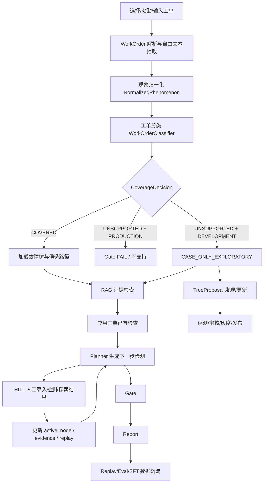

# 故障树诊断 Agent 开发者说明书

本文档是项目的开发者事实源。后续凡是修改诊断流程、状态字段、模块边界、工具协议、RAG/LLM/Gate 行为、UI 交互、数据目录或启动方式，都必须同步更新本文档。

## 1. 产品定位

本项目实现一个用于制造质量/售后诊断场景的故障树诊断 + Tree Evolution Agent。生产诊断主链路只使用已审核发布的 `Released Tree`；无树工单在开发态可以进入 case-only 临时诊断，并沉淀为 TreeProposal，经过评测、人工审核、灰度验证和发布后，才能成为新的生产故障树。

当前产品形态：

- Streamlit 诊断工作台：`app/streamlit_app.py`
- Python 核心诊断引擎：`src/ft_diag_agent/`
- 本地 RDF 故障树数据层：`rdflib`
- 本地文档/历史工单 RAG：`data/raw_docs/` + `data/chroma/`
- LLM 增强：DeepSeek/OpenAI-compatible JSON 抽取与分类增强
- HITL 人工检测录入：所有故障树 test 当前均作为人工检测处理
- Gate 风险门禁：确定性 PASS/GRAY/FAIL
- Report 报告生成：Markdown + JSON
- Replay/Eval/SFT 数据闭环：`runs/`、`datasets/`
- Tree Evolution：从 unsupported case-only 工单发现候选树，形成 TreeProposal 生命周期和审核发布流程

## 2. 运行模式

系统支持三种诊断模式：

- `PRODUCTION`：生产态。只能使用 `Released Tree`。若工单不被已发布故障树覆盖，直接 `UNSUPPORTED`，Gate 为 `FAIL`，不允许强行诊断。
- `DEVELOPMENT`：开发态。若工单不被现有故障树覆盖，会转入探索模式。
- `CASE_ONLY_EXPLORATORY`：无故障树覆盖的历史工单/RAG/人工探索模式。可以沉淀 replay、TreeProposal 和偏好数据，但 Gate 永远不能 `PASS`，只能保持 `GRAY` 并标注不可生产放行。

## 3. 主流程

工单驱动主流程如下。当前三种 UI 输入方式都会先形成 `WorkOrder`：mock 工单直接读取，粘贴文本走自由文本抽取，仅输入故障现象会包装为 `extraction_method="SIMPLE_INPUT"` 的轻量工单。



核心编排入口在 `src/ft_diag_agent/workflow.py` 的 `DiagnosticEngine`。`run_until_hitl()` 默认调用 LangGraph 编排；若 LangGraph 不可用，回退到等价的直接 Python 顺序执行。

## 4. 模块总览

| 模块 | 文件 | 主要职责 |
|---|---|---|
| 配置 | `settings.py` | 读取环境变量，定义目录、LLM、RAG、诊断模式配置 |
| 领域模型 | `models.py` | Pydantic 数据模型和枚举 |
| 工单解析 | `work_orders.py` | mock 工单、自由文本工单、LLM/规则混合抽取 |
| Intake | `intake.py` | 原始现象归一化为 `NormalizedPhenomenon` |
| LLM Provider | `llm.py` | DeepSeek/OpenAI-compatible JSON 调用封装 |
| 工单分类 | `classifier.py` | 判断工单属于哪棵故障树或 unsupported |
| 故障树数据层 | `fault_tree.py` | TTL 解析、路径枚举、节点/检测/处置查询 |
| RAG | `rag.py` | 文档解析、chunk、Chroma 持久化、检索证据 |
| Planner | `planner.py` | 基于当前节点/候选路径生成 `DiagnosticAction` |
| Case-Only Planner | `case_only_planner.py` | 无故障树覆盖时生成探索假设、计划和 HITL 检查 |
| Rework Guard | `rework_guard.py` | 识别返修、前次误判、无效处置和需避免的重复动作 |
| Tool Registry | `tools.py` | 统一工具协议、HITL 工具、RAG/故障树/生产接口 stub |
| Gate | `gate.py` | 确定性风险门禁 |
| Diagnostic Explain | `diagnostic_explain.py` | 将 `DiagnosticState` 转换为诊断时间线、Planner/Gate 因果解释和证据摘要 |
| Report | `report.py` | Markdown/JSON 报告生成 |
| Replay | `replay.py` | 诊断轨迹 JSONL 写入 |
| Eval/Dataset | `eval.py` | 导出 SFT/preference/eval 数据集 |
| Tree Evolution | `dynamic_tree.py` / `tree_generation.py` / `tree_generation_eval.py` / `tree_proposals.py` | 从 case-only、replay、批量文档和已有树漂移中形成 TreeProposal、聚类、抽取质量评测、审核与发布入口 |
| UI | `app/streamlit_app.py` | Streamlit 工作台 |

## 5. 关键数据模型

所有核心状态都定义在 `src/ft_diag_agent/models.py`。

### 5.1 `WorkOrder`

输入来源：

- `data/raw_docs/mock_work_orders_*.md`
- UI 粘贴自由文本/Markdown/OCR 文本
- UI 简单故障现象输入

关键字段：

- `order_id`：工单编号。抽不到时生成 `PASTE-xxxxxxxx`。
- `title`：工单标题。
- `failure_phenomenon`：用于诊断路由的核心故障现象。
- `vin`、`created_time`、`vehicle_project`、`business_domain`、`source`、`station_or_scene`：工单上下文。
- `executed_checks`：工单中已经执行的检查或现场发现。
- `expected_route`、`expected_fault_tree`、`expected_leaf_symptom_id`：开发/评估字段。
- `extraction_method`：`STRICT_MARKDOWN`、`LLM_JSON`、`RULE_FALLBACK`。
- `raw_text`：原始工单全文。

输出去向：

- `DiagnosticState.work_order`
- `IntakeRequest.extra_context`
- `WorkOrderClassifier`
- Replay/Eval

### 5.2 `NormalizedPhenomenon`

输入：

- `IntakeRequest.raw_input`
- 工单上下文

输出：

- `phenomenon`：标准现象。
- `vehicle_info`：车型、VIN、工厂、工位。
- `context`：时间、严重度、已执行检查等。
- `quality_notes`：归一化风险提示。

### 5.3 `WorkOrderClassification` 与 `CoverageDecision`

输入：

- `WorkOrder`
- 当前故障树集合
- 可选 LLM JSON 分类结果

输出：

- `tree_id`：匹配故障树 ID，或 `None`。
- `coverage_status`：`COVERED`、`UNSUPPORTED`、`AMBIGUOUS`。
- `confidence`：置信度。
- `diagnosis_mode`：生产态或开发探索态。
- `reasoning_summary`、`signals`：可追溯分类原因。

### 5.4 `DiagnosticState`

`DiagnosticState` 是诊断状态机的中心状态，主要字段：

- `case_id`
- `work_order`
- `classification`
- `coverage_decision`
- `diagnosis_mode`
- `active_tree_id`
- `active_node_id`
- `intake_request`
- `intake`
- `matched_trees`
- `candidate_paths`
- `candidate_causes`
- `planned_actions`
- `executed_tests`
- `evidence_chain`
- `tool_calls`
- `rework_risk`
- `gate_result`
- `human_feedback`
- `final_report`
- `replay_trace`
- `data_quality_notes`

输入：

- UI、工单解析、人工检测结果、工具结果。

输出：

- Planner 输入、Gate 输入、Report 输入、Replay 记录。

### 5.5 `ReworkRiskAssessment`

输入：

- `WorkOrder.failure_phenomenon`
- `WorkOrder.description`
- `WorkOrder.station_or_scene`
- `WorkOrder.executed_checks`

输出：

- `is_rework_suspected`：是否疑似返修/维修后复现。
- `is_prior_misdiagnosis_suspected`：是否存在前次误判或前次处置方向无效。
- `prior_actions`：识别到的前次处置方向。
- `ineffective_actions`：无效动作，例如更换屏幕无改善、调整锁扣后仍复现。
- `avoided_repeat_actions`：本次诊断需要避免重复执行的动作。
- `recommended_checks`：建议优先补充的反证检查。
- `similar_cases`：RAG 检索到的历史相似返修/处置无效案例。
- `evidence_snippets`：触发判断的工单片段。

使用位置：

- `DiagnosticState.rework_risk`
- Planner 会把 `recommended_checks` 提升为 `REWORK_COUNTER_CHECK` HITL 动作，优先级高于普通故障树 test。
- Planner 动作的 `risk_notes`
- Gate `risk_notes` / `required_actions`
- Report 的“返修/误判风险”章节
- Eval 的 `rework_or_misdiagnosis_identification_rate`

边界：

- 相似案例检索只在当前工单已有“维修站、再次、仍复现、更换/调整、返修、无改善”等弱风险信号时启用，避免普通工单被历史返修样例带偏。
- 相似案例只用于风险提示和反证检查，不直接确认根因，也不覆盖 Gate 结论。
- `REWORK_COUNTER_CHECK` 不对应 TTL 中的固定 test，它是为了让人先确认前次无效处置或相邻根因风险，再继续执行故障树路径。

### 5.6 `DiagnosticAction`

Planner 输出的下一步动作。

字段：

- `action_type`：当前主要为 `TEST`、`CASE_ONLY_HITL`、`REWORK_COUNTER_CHECK` 或 `CONFIRMATION_CHECK`。
- `target_node_id`、`target_cause_id`
- `test_id`
- `tool_name`：当前故障树 test 均为 `human_input`。
- `priority`
- `blocking`
- `expected_result_schema`
- `reason`
- `source_refs`
- `planner_source`：`RULE`、`LLM`、`MIXED` 等动作来源。
- `evidence_ids`：生成该动作时引用的证据 ID。
- `confidence`：Planner 对该动作有效性的置信度。
- `risk_notes`：动作级风险提示。

### 5.7 Case-Only 探索模型

无故障树覆盖时，系统使用下列模型表达“探索性诊断”，但不允许生产 `PASS`。

`CaseOnlyHypothesis`：

- `hypothesis_id`
- `system_area`
- `component`
- `failure_mode`
- `rationale`
- `confidence`
- `supporting_evidence_ids`
- `contradicting_evidence_ids`
- `next_check_ids`
- `status`：`OPEN`、`SUPPORTED`、`REFUTED` 或 `NEEDS_EVIDENCE`

`ExploratoryDiagnosticPlan`：

- `objective`
- `summary`
- `planner_source`
- `hypothesis_ids`
- `next_action_ids`
- `evidence_ids`
- `risk_notes`
- `iteration`
- `completed_action_ids`
- `stopped_reason`

`ExploratoryFinding`：

- `action_id`
- `test_id`
- `result`
- `supports_hypothesis_ids`
- `refutes_hypothesis_ids`
- `evidence_id`
- `notes`

### 5.8 动态故障树候选请求模型

文件：`src/ft_diag_agent/dynamic_tree.py`

模型：

- `FaultTreeGenerationRequest`
- `FaultTreeDraft`
- `FaultTreeRequestCluster`
- `FaultTreeReviewStatus`
- `FaultTreePromotionDecision`

定位：

- 当前实现仍是 Tree Evolution 的前置层，负责把 unsupported development 诊断沉淀为候选树生成请求和跨 runs 聚类。
- 后续应升级为正式 `TreeProposal Store`，详见 `docs/tree_evolution_plan.md`。
- 生产诊断不直接使用这些请求或聚类；只有经过生命周期晋升并发布为 `RELEASED_TREE` 的树，才能进入生产主链路。

触发条件：

- `coverage_status=UNSUPPORTED`
- `diagnosis_mode=CASE_ONLY_EXPLORATORY`
- 已生成 case-only 假设、探索计划或人工探索发现

用途：

- 将当前开发态探索沉淀为“候选故障树生成任务”。
- 给后续故障树生成 Agent 提供来源工单、候选入口现象、候选根因假设、建议检查项、证据 ID 和来源引用。
- 将请求归入 `FaultTreeRequestCluster`，形成候选树生成任务的聚类种子和审核状态建议。
- 从 `runs/*.jsonl` 跨诊断记录合并相似动态树请求，导出 `datasets/dynamic_tree_clusters.jsonl`，并在 Streamlit Replay 页展示聚类历史。
- 对齐 `docs/tree_gen_agent.md` 的核心约束：诊断 Agent 不直接生成最终 `FaultTree`，只生成本体建模请求。

关键约束：

- 不允许 LLM 直接输出最终 FaultTree 或修改 `FaultTree.symptom_ids`。
- LLM/Agent 只负责维护 `FailureSymptom`、`OntologyTest`、`OntologyMeasure`、`SymptomTransition`。
- 最终 FaultTree 必须由 start 节点沿 `SymptomTransition` 确定性 BFS 重建。
- 候选请求必须人工审核后才能进入生产树库。
- 该请求不影响 Gate，不能让 case-only 结果生产 `PASS`。
- 跨 runs 聚类的 `support_count` 按独立诊断 case 数计算，不把工单号、RAG 来源引用等辅助 ID 计入审核门槛。
- `allowed_next_statuses` 只给出审核流转建议，不会自动晋升到 `UNDER_REVIEW`、`SHADOW_MODE` 或 `PRODUCTION_APPROVED`。

输出位置：

- `DiagnosticState.fault_tree_generation_request`
- `DiagnosticState.fault_tree_request_cluster`
- `datasets/dynamic_tree_clusters.jsonl`
- Report 的“动态故障树候选请求”章节
- Streamlit 诊断概览中的“动态故障树候选请求”展开区
- Streamlit Replay 页中的“跨 runs 动态故障树聚类”

### 5.9 TreeProposal 生命周期模型（部分实现）

设计文档：

- `docs/tree_evolution_plan.md`

目标：

- 将“无树 case-only 诊断”改造成候选故障树的发现、生成入口和受控发布流程。
- 让多个 unsupported 工单中的稳定模式沉淀为 TreeProposal。
- 通过评测和人工审核把 TreeProposal 逐步晋升为 `RELEASED_TREE`。

已实现基础模型：

- `TreeProposal`
- `TreeProposalStatus`
- `TreeProposalCaseLink`
- `TreeProposalEvalResult`
- `TreeProposalReviewLog`

待补齐发布模型：

- release manifest
- rollback metadata
- TreeProposal artifact manifest / 发布版本索引

生命周期：

- `DRAFT_TREE`：由单个或少量 unsupported development case 发现，只能用于探索和聚合证据。
- `CANDIDATE_TREE`：达到相似 case、root cause family、关键检查项和人工有效率门槛后生成候选树。
- `GRAY_TREE`：通过 offline replay、schema/test/evidence coverage 和专家初审后进入灰度辅助诊断。
- `RELEASED_TREE`：通过正式专家审核、golden set、风险阈值、适用范围、版本和 rollback 检查后进入生产主链路。
- `REJECTED`：证据不足、重复、误导风险高或审核失败。

关键限制：

- `DRAFT_TREE`、`CANDIDATE_TREE`、`GRAY_TREE` 都不能让 Gate `PASS`。
- `GRAY_TREE` 可以辅助诊断和 shadow 对比，但不能覆盖 `RELEASED_TREE`。
- `RELEASED_TREE` 必须有 release manifest 和 rollback 信息。
- 动态生成过程必须遵守 `docs/tree_gen_agent.md`：先维护本体实体和 `SymptomTransition`，再确定性重建 `FaultTree`。

已实现 store：

- `data/tree_proposals/proposals.jsonl`
- `data/tree_proposals/case_links.jsonl`
- `data/tree_proposals/eval_results.jsonl`
- `data/tree_proposals/review_logs.jsonl`
- `data/tree_proposals/artifacts/{proposal_id}/`

已实现模块：

- 已实现第一入口：`src/ft_diag_agent/tree_generation.py`
- 审核 store：`src/ft_diag_agent/tree_proposals.py`
- Tree Proposal Eval：`src/ft_diag_agent/tree_proposal_eval.py`
- Tree Generation Extraction Eval：`src/ft_diag_agent/tree_generation_eval.py`
- 跨 proposal 聚合：`src/ft_diag_agent/tree_proposal_analytics.py`
- 晋升预审：`src/ft_diag_agent/tree_proposal_precheck.py`
- 审核视图辅助：`src/ft_diag_agent/tree_proposal_view.py`
- Streamlit TreeProposal 审核页。
- 第二入口：开发态 case-only `FaultTreeGenerationRequest` 和跨 runs `FaultTreeRequestCluster` 可写入/更新 `DRAFT_TREE` proposal。

当前审核边界：

- 支持 proposal upsert、case link、eval result、review log 和 artifact snapshot。
- 支持从 `FaultTreeGenerationRequest` 生成 `source_type=WORK_ORDER_TRIGGER` 的 proposal，并写入去重后的 `TreeProposalCaseLink`。
- 支持从 `FaultTreeRequestCluster` 生成 `source_type=DYNAMIC_CLUSTER` 的 proposal，选中聚类或批量聚类均使用稳定 proposal id 更新同一记录。
- `TreeProposal.source_request_id` / `source_cluster_id` 用于追溯第二入口来源。
- `TreeProposal.proposal_kind` 区分 `NEW_TREE` 与 `TREE_CHANGE`。`NEW_TREE` 仍用于无树覆盖新增树；`TREE_CHANGE` 用于已有 Released/Gray/Draft Tree 的分支、检测项、阈值、condition、executor、scope 或版本化 patch 变更。
- `DiagnosticState.tree_change_proposal` 记录 covered case 中由工艺漂移、检测项不可执行、阈值变化、反复反证、返修或前次误判触发的已有树变更候选。它会进入 report/replay，但不改变 Gate，不写 TTL。
- 支持 `DRAFT_TREE -> CANDIDATE_TREE`、`REQUEST_CHANGES` 保持当前状态、`REJECT` 进入 `REJECTED`。
- 支持确定性晋升预审：输出 `READY_FOR_REVIEW`、`NEEDS_MORE_EVIDENCE`、`BLOCKED` 或 `NOT_APPLICABLE`。
- 预审会检查 start/root/test、source case、evidence、artifact、Tree Proposal Eval unsafe findings、Tree Generation Extraction Eval unsafe findings、support case count 和 evidence binding rate。
- 预审可消费 `TreeProposalAggregateReport`，把跨 proposal 聚合 blocker/warning/satisfied/recommended action 合并进单 proposal 预审结果。
- 跨 proposal 聚合口径：
  - `phenomenon_bucket`：同类现象 bucket 内 proposal 数、支持 case、反证 case 和人工确认率。
  - `root_cause_family`：同一候选根因族的 proposal 覆盖、支持/反证 case、人工确认率和风险计数。
  - `repeated_test`：重复出现的 candidate/useful test、支持/反证 case、人工确认率和风险计数。
  - 高风险反证：来自 `REFUTES` case link、`human_confirmed=False`、eval unsafe findings、拒绝/请求修改审核日志和高风险 risk notes。
- 聚合预审只辅助人工审核；不会自动晋升状态，不写生产 TTL，不影响 Gate。
- 预审结果只辅助人工审核，不自动晋升；人工审核日志会保存 `precheck_result` 快照。
- 审核页必须优先展示人类可读 proposed tree：有 artifact 时展示 L1/L2/L3、字段状态和 transition/test；没有 artifact 时展示 `DISCOVERY_ONLY` skeleton 并标明不能晋升。
- 审核页展示 8 步流程状态条：来源输入、DRAFT 草案、L1/L2/L3 结构、HITL 补全、Proposal Eval、人工审核、Replay/Shadow、生产 TTL 发布。
- `src/ft_diag_agent/tree_admission.py` 提供准入材料包：`GRAY` 准入检查 artifact、source case/evidence、结构 eval、shadow eval、候选审核日志和适用范围；`RELEASED` 准入检查 release artifact、manifest、rollback、TTL diff、`tree_generation_extraction_v1`、shadow/golden 记录、Gray 审核日志和正式发布签核。
- 审核页 `准入材料` tab 展示同一套 admission package，包含材料名称、状态、来源 ID/path、阻塞/警告细节和建议动作；晋升预审也消费这套 package，避免 UI 与 precheck 规则漂移。
- `CANDIDATE_TREE -> GRAY_TREE` 预审会继承 DRAFT 结构预审，要求 `DRAFT_TREE -> CANDIDATE_TREE` 专家审核日志，并要求通过 `tree_proposal_replay_shadow_v1` replay-based shadow eval；缺失或存在 unsafe findings 时阻塞。
- `GRAY_TREE -> RELEASED_TREE` 预审会检查 release artifact、release manifest、rollback metadata、TTL diff、generated TTL preview、`tree_generation_extraction_v1`、shadow eval 通过记录、`CANDIDATE_TREE -> GRAY_TREE` 审核日志和专家正式发布签核。
- `src/ft_diag_agent/released_tree_registry.py` 提供 Released Tree registry、生产 TTL 写入执行和 rollback 演练：`RELEASED_TREE` proposal 在 release artifact、正式签核、rollback、`tree_generation_extraction_v1`、runtime-compatible TTL preview 和 tree_id 唯一性均通过后，写入 `data/released_trees/registry.jsonl` 的 `READY_FOR_TTL_WRITE` 记录，并把审计结果写入 `ttl_audit_results.jsonl`。
- 生产 TTL 写入动作必须消费已有 `READY_FOR_TTL_WRITE` registry entry，复核 release artifact TTL hash 和生产 TTL parse/tree_id 去重，写入前在 `data/released_trees/backups/` 生成备份，成功后追加 generated TTL preview 并把 registry entry 标记为 `REGISTERED`；rollback dry-run 只验证备份可恢复，正式 rollback 从备份恢复 TTL 并标记 `ROLLED_BACK`。
- 第一版允许在 shadow eval 无阻塞后人工审核 `CANDIDATE_TREE -> GRAY_TREE`，也允许在发布材料齐全后提交 `GRAY_TREE -> RELEASED_TREE` 人工审核；受控写入会修改配置的生产 TTL 文件，但不自动改变 Gate 或分类器运行时缓存。
- 审核日志不等于正式 release manifest；release artifact 位于 `data/tree_proposals/artifacts/{proposal_id}/release/`，包含 `manifest.json`、`rollback_metadata.json`、`generated_ttl_preview.ttl`、`ttl_diff.md` 和 `release_artifact.json`。
- Tree Proposal Eval 第一版为确定性指标：schema validity、validation errors、start/root/test/transition counts、root-to-test coverage、missing test bindings、evidence binding rate、HITL confirmation rate、pending HITL count 和 unsafe blockers。
- Tree Generation Extraction Eval 第一版为 `tree_generation_extraction_v1`：ontology structure、field completeness、source fact recall、grounding precision、hallucination rate、path coherence、test actionability、contradiction count 和 duplicate semantic rate。批量生成完成后自动写入 eval result；DRAFT 晋升必须已有该结果。结构、链路和幻觉 blocker 会阻塞，source recall 在 v1 仅作为 warning。
- replay-based shadow eval 第一版为离线 simulation：读取 `runs/*.jsonl`，按 proposal 的 start/root/test/evidence 与 replay 内容匹配，输出相关 replay 数、root/test 支持率、证据命中率、失败案例和 unsafe findings；它不执行线上灰度、不调用 LLM judge、不允许候选树影响生产 Gate。

规划模块：

- 正式 shadow/gray 服务、发布后监控、自动触发回滚策略和生产 registry 服务化。

### 5.10 批量文档树生成模型

文件：

- `src/ft_diag_agent/tree_generation.py`

用途：

- 支持用户批量上传或选择质量报告、8D、SOP、FMEA、维修资料。
- 按 `docs/tree_ontology_schema.md` 和 `docs/tree_gen_agent.md` 的原则生成候选本体草案。
- 输出 `TreeGenerationJob`、`TreeGenerationArtifact` 和 `TreeProposal(status=DRAFT_TREE)`。
- 输出 `TreeGenerationArtifact.stage_timings`，记录复制资料、chunk、PASS_1、PASS_2、PASS_3、validate、PASS_4、rebuild、proposal 和 persist 等阶段耗时。
- 支持 Mermaid 树结构可视化，节点显示 level/status，边上显示绑定的 test。

业务定义：

- 故障树是可执行诊断知识库，不是文档摘要树。
- `start = L1 = 一棵树唯一入口故障/失效现象`。
- `inner = L2 = 中间异常状态`，可以有多层，只要仍可继续诊断分解。
- `root = L3 = 不可再拆分的根因`。若还能继续拆分，则应建模为 inner，而不是 root。
- 树生成阶段只能输出本体草案和 `TreeProposal`，不能直接进入生产诊断主链路。

输入：

- `PDF/MD/TXT/CSV`
- 生成任务标题和补充说明。二者只能作为 job metadata / prompt 上下文，不能作为 evidence source，不能进入 `FailureSymptom`、`OntologyTest`、`OntologyMeasure` 或 `SymptomTransition`。
- LLM-first 多轮本体抽取/修复

处理流程：

1. 将输入资料复制到 `data/tree_generation/uploads/{job_id}/`。
2. 读取文档文本。
3. 将资料切成多个 chunk，并保留 `chunk_id` / `source_path`。
4. 优先使用 LLM 多轮抽取；`docs/tree_gen_agent.md` 的成功经验已经工程化为代码阶段、schema adapter 和校验规则：
   - PASS_1：候选实体抽取，分别抽取候选异常状态、检查项、处置措施和原文诊断链提示。
   - PASS_2：实体分类、去重、合并同义 start、判定 start/inner/root；本轮不生成 transition。
   - PASS_3：基于已分级实体生成 `SymptomTransition`，每条边绑定 `OntologyTest`。
   - VALIDATE：运行确定性图规则校验，检查 start/root/test/transition、可达性、环和字段状态。
   - PASS_4：根据校验问题进行 LLM repair。
   - PASS_4 后有确定性防删保护：`EXTRACTED_INFERRED` / `MISSING` 表示待 HITL 补全/确认，不允许因为低置信、GRAY 或缺最终验证就被删除；若 repair 轮误删，会恢复到 artifact 并进入 HITL 候选。
   - 若 PASS_2 建图失败但 PASS_1 有候选实体，系统会用候选实体确定性组装 `NEEDS_REPAIR_LLM_DRAFT`，避免退回旧规则抽取。
5. 若 LLM 不可用或抽取失败，规则抽取只作为低置信 debug fallback，输出 `LOW_CONF_DEBUG_DRAFT`。
6. 生成本体草案：
   - `FailureSymptom(start/root)`
   - `OntologyTest`
   - `OntologyMeasure`
   - `SymptomTransition`
7. 运行结构校验，输出 `OntologyValidationIssue`，包含 severity、rule_id、message、entity_refs、repair_hint。
8. 使用确定性 BFS 生成 `rebuilt_fault_tree` 预览。
9. 生成 `TreeProposal(status=DRAFT_TREE)`。

输出目录：

- `data/tree_generation/jobs/{job_id}.json`
- `data/tree_generation/uploads/{job_id}/`
- `data/tree_generation/artifacts/{job_id}/artifact.json`
- `data/tree_generation/artifacts/{job_id}/proposal.json`
- `data/tree_generation/artifacts/{job_id}/rebuilt_tree_preview.json`
- `data/tree_proposals/proposals.jsonl`

可视化脚本：

```bash
.venv/bin/python scripts/render_tree_generation_tree.py data/tree_generation/artifacts/<JOB_ID>/artifact.json
.venv/bin/python scripts/render_tree_generation_tree.py data/tree_generation/artifacts/<JOB_ID>/artifact.json --output /tmp/tree.md
```

关键限制：

- 不写入正式 `corrected_fault_tree_instances.ttl`。
- 不接入生产分类/诊断主链路。
- 不允许 Gate `PASS`。
- 生成的 `FaultTree` 只是 deterministic BFS preview，用于审核和 eval 前置。
- `LOW_CONF_DEBUG_DRAFT` 只用于流程调试，不应作为高质量候选树。
- 每个 `OntologyExtractionPass` 会记录 `output_counts`、`output_preview`、`raw_output` 和 `raw_text`，供 UI 同时展示适配后的抽取预览、LLM parsed JSON 与模型原始响应文本；`output_preview` 必须保留关键 status，但它仍只是调试预览，不是 HITL 事实源。
- PASS_1 若返回 `{}` 或候选全空，会自动触发一次强约束重试；重试要求逐 chunk 抽取，资料不足时也必须输出 `MISSING` 候选和 `risk_notes`。
- PASS_1 适配器对非核心字段做容错：`risk_notes` 可以是字符串或字符串列表，字符串会按编号切分；`transition_hints` 可以是字符串或对象列表，对象会转成 JSON 字符串进入后续建图上下文。
- 规则 fallback 只能从输入文档 chunk 抽取，不能从任务标题或补充说明抽取；资料缺失时输出 `MISSING` 占位，而不是用任务元数据补位。
- LLM schema adapter 兼容 `tree_gen_agent.md` 风格字段，例如 `symptom_name/symptom_level`、`test_name`、`source/target/test_id`。
- LLM candidate adapter 兼容常见宽字段：`entities`、`root_causes`、`failure_modes`、`abnormal_states`、`checks`、`diagnostic_paths`、`causal_chains`。
- LLM 返回空本体图时不能视为成功抽取；若有候选实体则确定性组装待审核草案，否则进入低置信兜底并展示 raw payload preview。
- 抽取阶段 FieldStatus 只能使用 `EXTRACTED_EXPLICIT`、`EXTRACTED_INFERRED`、`MISSING`。
- `SUGGESTED_GROUNDED` / `SUGGESTED_LOW_CONF` 属于补全阶段，不应作为原文抽取结果。
- 树生成 HITL 用于补全知识库字段；诊断 HITL 用于人工执行当前案例的检测，两者不可混用。
- 生成阶段补全建议必须基于原文语境 + RAG + LLM 领域/工艺/维修知识。LLM 行业知识只能辅助生成候选选项，不能脱离当前场景自由发挥。
- 代码层面，抽取阶段如果收到 `SUGGESTED_*`，会映射为 `EXTRACTED_INFERRED`。
- draft entity 的 `properties.needs_generation_hitl` / `properties.hitl_reasons` 和 `generation_hitl_items(artifact)` 用于生成树生成 HITL 补全候选列表。
- 当前已实现 HITL 候选扫描、专家建议选项生成、UI 展示和人工确认写回。建议对象写入 `TreeGenerationHitlSuggestion`，人工决策写入 `TreeGenerationHitlDecision`；确认写回后字段状态推进为 `CONFIRMED`，并重跑结构校验和确定性 BFS 预览。
- HITL 建议生成顺序必须是：当前输入资料原文 chunk 优先，RAG 命中的 SOP/FMEA/维修手册/历史工单次之，领域/工艺/维修专家知识只做术语和检查口径补强。若原文和 RAG 都不足，LLM 应返回空建议并提示补资料，而不是编造可确认值。
- 已实现 release manifest、rollback metadata 和 TTL diff 审核材料；尚未实现正式 TTL 发布、Released Tree registry、
  发布后监控和自动回滚执行。
- Streamlit 生成时通过 progress callback 展示当前阶段和耗时；生成完成后在“阶段耗时”页签展示 `stage_timings`。
- Tree Generation job 列表按 `updated_at/created_at` 倒序展示；生成完成后自动选中新 job，表单展示本次 LLM enable/provider/model 配置，避免历史低置信任务被误认为当前运行结果。

FieldStatus 生命周期：

- `EXTRACTED_EXPLICIT`：原文直接出现且信息充分，默认不需要补问，但仍可被审核。
- `EXTRACTED_INFERRED`：原文有部分支持，需要弱推断，必须进入 HITL 补全候选队列。
- `MISSING`：原文完全缺失，必须进入 HITL 补全候选队列。
- `SUGGESTED_GROUNDED`：补全阶段由 LLM 基于原文、RAG 和领域知识提出的有证据约束建议。
- `SUGGESTED_LOW_CONF`：补全阶段的低置信建议。
- `CONFIRMED`：用户确认后的知识库字段。
- `VERIFIED`：经诊断检测或验证动作确认的字段/证据。

### 5.11 `EvidenceItem`

统一证据模型。

来源：

- RAG 文档检索：`source_type="RAG"`
- 工单已有检查：`source_type="WORK_ORDER"`
- 人工录入：`source_type="HITL"`
- 生产接口 stub：`source_type` 为对应工具名

字段：

- `claim`：证据断言。
- `supports_node_id`、`supports_cause_id`：支持的节点/根因。
- `strength`：证据强度。
- `source_refs`：来源引用。
- `raw_payload`：原始数据。

### 5.12 `GateResult`

Gate 输出。

字段：

- `status`：`PASS`、`GRAY`、`FAIL`
- `blocking_reasons`
- `required_actions`
- `risk_notes`
- `can_generate_final_report`

### 5.13 `ReplayRecord`

每次开始诊断或人工检测提交后记录。

字段：

- `state_before`
- `planner_output`
- `tool_call`
- `tool_result`
- `state_after`
- `gate_result`
- `human_decision`
- `accepted`
- `rejected_reason`

## 6. 工单解析模块

文件：`src/ft_diag_agent/work_orders.py`

### 6.1 mock 工单解析

函数：

- `parse_work_order_files(raw_docs_dir)`
- `parse_work_order_markdown(path)`
- `parse_work_order_markdown_text(text, source_path=None)`

输入：

- `data/raw_docs/mock_work_orders_*.md`
- 严格标题格式：`## WO-...｜标题`

输出：

- `list[WorkOrder]`

用途：

- 开发评测集
- offline eval 标签
- UI mock 工单选择

### 6.2 自由文本工单解析

函数：

- `parse_pasted_work_order_text(text, settings=None, source_path=None)`

策略：

1. 先尝试严格 Markdown mock 解析。
2. 若失败且 `LLM_ENABLE=true`，调用 LLM JSON 抽取。
3. LLM 不可用或失败时，规则 fallback：
   - 工单编号
   - VIN
   - 创建时间
   - 车型/工厂
   - 业务域
   - 故障标签
   - 初步检查记录
   - 现场发现
   - 期望路由/期望故障树
4. 即使字段很少，也创建 `WorkOrder` 并保留 `raw_text`，不能因标题格式失败中断诊断。

输入：

- UI 粘贴文本，自由文本/Markdown/OCR 均可。

输出：

- `WorkOrder | None`

## 7. LLM Provider

文件：`src/ft_diag_agent/llm.py`

当前支持：

- `deepseek`
- `openai`

DeepSeek 配置：

- `LLM_PROVIDER=deepseek`
- `LLM_ENABLE=true`
- `DEEPSEEK_API_KEY`
- `DEEPSEEK_BASE_URL=https://api.deepseek.com`
- `DEEPSEEK_MODEL_FAST=deepseek-v4-flash`
- `DEEPSEEK_MODEL_PRO=deepseek-v4-pro`

核心接口：

- `LlmProvider.enabled`
- `LlmProvider.json_completion(system_prompt, user_prompt, response_model, complexity)`

输入：

- system prompt
- user prompt
- Pydantic response model
- `complexity="fast" | "pro"`

输出：

- 校验后的 Pydantic 对象，或 `None`

使用场景：

- 自由文本工单结构化抽取
- 低置信工单分类增强

约束：

- 所有 LLM 输出必须通过 Pydantic 校验。
- LLM 失败不能中断流程，必须回退到规则逻辑。
- LLM 不允许覆盖 Gate 的确定性结论。

## 8. 故障树数据层

文件：`src/ft_diag_agent/fault_tree.py`

技术：

- `rdflib`
- TTL/RDF 本地解析

解析实体：

- `FailureSymptom`
- `OntologyTest`
- `OntologyMeasure`
- `SymptomTransition`
- `FaultTree`

核心能力：

- TTL 解析为内存索引。
- 起点节点识别。
- transition 出边查询。
- start 到 root 的路径枚举。
- 候选根因构造。
- 故障树检索。
- 数据质量提示，例如缺 `testName`、缺 `condition`。

输入：

- `corrected_fault_tree_instances.ttl`
- `data/released_trees/registry.jsonl`：Released Tree registry 记录，包含 `READY_FOR_TTL_WRITE / REGISTERED / ROLLED_BACK` 状态；清理前应确认是否仍需生产发布审计追溯。
- `data/released_trees/ttl_audit_results.jsonl`：生产 TTL 写入 READY 审计历史，可按 proposal 追溯或清理。
- `data/released_trees/ttl_write_results.jsonl`：受控生产 TTL 写入执行历史，记录 backup path、TTL hash 和阻塞项。
- `data/released_trees/ttl_rollback_results.jsonl`：rollback dry-run / execute 历史，记录恢复来源和阻塞项。
- `data/released_trees/backups/`：生产 TTL 写入前备份目录；可在确认不需要回滚演练和发布审计后清理。

输出：

- `FaultTree`
- `SymptomNode`
- `DiagnosticTest`
- `Transition`
- `Measure`
- `DiagnosticPath`
- `CandidateCause`

未来替换点：

- 当前是 RDF 内存解析。
- 保留 repository 边界，后续可替换为 Neo4j/图数据库。

## 9. RAG 模块

文件：`src/ft_diag_agent/rag.py`

技术：

- `pypdf`
- `csv`
- `chromadb`
- 本地确定性 hash embedding fallback

输入目录：

- `data/raw_docs/`

支持文件：

- PDF
- MD
- TXT
- CSV

核心能力：

- 扫描真实文档和 mock 工单。
- 扫描 labeled eval v1 时会清洗标注真值字段，避免 `expected_*`、闭环维修动作、人工复核结论进入 RAG 证据。
- chunk 文本。
- 从文件名/内容推断 metadata：
  - `doc_type`
  - `tree_id`
  - `phenomenon`
  - `work_order_id`
  - `expected_leaf_symptom_id`
- 写入 Chroma 持久化目录 `data/chroma/`。
- 检索时优先 Chroma，失败时 lexical fallback。

输入：

- query 文本
- `top_k`

输出：

- `list[EvidenceItem]`

重要边界：

- RAG 返回的是证据候选，不直接决定根因。
- 根因确认必须经过 Planner/HITL/Gate。
- 评测标注文件可作为历史相似案例语料，但 RAG 只保留运行时可见的 `case_id`、故障类型、描述、已有检查等字段。

## 10. 工单分类与覆盖判断

文件：`src/ft_diag_agent/classifier.py`

策略：

1. 故障树 start symptom/描述检索。
2. `expected_leaf_symptom_id` 开发标签辅助。
3. 关键词规则：
   - `FT_001`：车机黑屏相关。
   - `FT_002`：车门无法关闭相关。
4. 否定描述抑制：
   - 例如“无黑屏”“无车门闭合抱怨”不会被当作正向命中。
5. 低置信时可调用 LLM JSON 分类。

输入：

- `WorkOrder`
- `DiagnosisMode`
- 故障树 repository

输出：

- `WorkOrderClassification`
- `CoverageDecision`

生产态行为：

- `UNSUPPORTED` 直接 FAIL。

开发态行为：

- `UNSUPPORTED` 转为 `CASE_ONLY_EXPLORATORY`。

## 11. Planner

文件：`src/ft_diag_agent/planner.py`

当前策略：

- 若存在 `active_tree_id` + `active_node_id`：
  - 从当前节点读取 outgoing transitions。
  - 每条 transition 生成一个人工检测动作。
  - 若当前节点已有疑似根因或已推进到关键诊断节点，则生成 `CONFIRMATION_CHECK` 发布前补证动作。
  - 补证动作不阻断 Gate PASS，但会提示人工补充确认性证据，例如 PMIC 输出、背光驱动、锁扣涂色啮合、门锁二道锁信号等。
- 若没有活动节点：
  - 从候选路径中选择尚未执行的下一项 test。
  - 根据路径深度、证据强度、根因等计算优先级。
- 若 `diagnosis_mode=CASE_ONLY_EXPLORATORY`：
  - `DiagnosticEngine.plan_case_only_exploration()` 调用 `CaseOnlyPlanner`。
  - 首轮 `CaseOnlyPlanner` 输出 `CaseOnlyHypothesis`、`ExploratoryDiagnosticPlan` 和 `CASE_ONLY_HITL` 动作。
  - 后续人工提交检查结果后，Planner 会根据 `ExploratoryFinding` 更新假设状态，抑制已执行检查，并围绕 `OPEN/NEEDS_EVIDENCE` 假设生成下一轮动作。
  - 动作来源为 RAG 历史/文档证据 + 可选 LLM planner + 领域规则兜底。
  - 动作会围绕假设生成，例如动力受限场景下的 BMS 保护性降额、高压互锁不稳定、VCU 扭矩请求链路异常。
  - 每个动作带 `planner_source`、`evidence_ids`、`confidence`、`risk_notes`，UI 会展示其来源和不可放行约束。
  - 人工提交后会生成 `ExploratoryFinding`，用于下一轮假设排序和动作生成，但不会推进故障树节点，也不会直接修改未审核的新树。
  - `FaultTreeGenerationRequest` / `TreeProposal` 是 case-only 全程探索证据的后置固化输入；已 `REFUTED` 的假设不会作为候选 root cause family。
- 若存在 `ReworkRiskAssessment.recommended_checks`：
  - `DiagnosticEngine.plan()` 会先生成 `REWORK_COUNTER_CHECK` 动作。
  - 这些动作的 `planner_source=REWORK_GUARD`，`tool_name=human_input`，用于优先确认返修/前次误判反证。
  - 普通故障树动作仍会保留在后面，避免反证检查把原诊断路径整体吞掉。
  - 在 `CASE_ONLY_EXPLORATORY` 中，反证动作和 case-only 自主探索动作会共存；反证优先，探索计划仍会生成。

输入：

- `DiagnosticState`

输出：

- `list[DiagnosticAction]`

当前执行策略：

- 所有故障树 test 都映射为：
  - `executor_type=HUMAN`
  - `tool_name="human_input"`
- `CONFIRMATION_CHECK` 也是 `human_input`，但不对应 TTL 中固定 transition test；它用于已定位后的补证、排除相邻分支和降低返修风险。

原因：

- 真实 SPC/BOM/曲线判异接口尚未接入。
- 后续由上游故障树生成 Agent 标注 test 的执行类型，再替换 Planner 的 `execution_spec_for_test()` 映射。

## 12. Tool Registry

文件：`src/ft_diag_agent/tools.py`

统一接口：

- `DiagnosticTool`
- `ToolRegistry`
- `ToolInput`
- `ToolOutput`
- `ToolCallRecord`

当前已注册工具：

| 工具 | 类型 | 当前状态 | 输出 |
|---|---|---|---|
| `fault_tree_search` | 真实工具 | 可用 | 故障树检索结果 |
| `rag_search` | 真实工具 | 可用 | RAG `EvidenceItem` |
| `human_input` | 真实工具 | 可用 | `ExecutedTest` + HITL 证据 |
| `spc_query` | stub | 预留 | stub evidence |
| `bom_lookup` | stub | 预留 | stub evidence |
| `fp_growth_rules` | stub | 预留 | stub evidence |
| `quality_case_search` | stub | 预留 | stub evidence |

输入：

- `tool_name`
- `payload`

输出：

- `ToolCallRecord`

错误处理：

- 未注册工具返回 `ToolStatus.ERROR`。
- 工具异常被捕获并写入 `ToolCallRecord.error`。

## 13. HITL 人工检测

UI 文件：`app/streamlit_app.py`

工具文件：`tools.py` 的 `HumanInputTool`

当前设计：

- 故障树上的所有 test 暂时都作为人工检测。
- UI 在“当前节点 / HITL”页展示：
  - 当前节点
  - outgoing transition
  - Planner 建议检测
  - test 目标、规则、条件范围
  - 人工检测结论
  - 检测值/读数
  - 是否支持进入目标分支
  - 证据强度
  - 备注
  - 是否采纳 Planner 建议

输入：

- 人工填写的检测结果。

输出：

- `ExecutedTest`
- `EvidenceItem(source_type="HITL")`
- `ToolCallRecord`
- 更新后的 `DiagnosticState`
- Replay 记录

## 14. Gate

文件：`src/ft_diag_agent/gate.py`

Gate 是确定性规则模块。

输入：

- `DiagnosticState`

输出：

- `GateResult`

核心规则：

- 无匹配故障树：生产态 `FAIL`。
- unsupported 生产态：`FAIL`，提示补充对应故障树后再诊断。
- unsupported 开发态：固定 `GRAY`，不可生产放行。即使人工探索证据强度很高、LLM/RAG 给出疑似原因，也不能转为 `PASS`。
- 缺关键检测/证据不足：`GRAY`。
- 到达叶子根因且证据足够：`PASS`。
- TTL 数据质量问题进入 `risk_notes`。
- `ReworkRiskAssessment` 的风险提示进入 `risk_notes`，建议反证检查进入 `required_actions`；返修风险本身不会直接把 `PASS` 改成 `FAIL`，但会进入报告和评测。

约束：

- LLM 可以解释，但不能覆盖 Gate 状态。

## 15. Report

文件：`src/ft_diag_agent/report.py`

输入：

- `DiagnosticState`

输出：

- `DiagnosisReport`
- Markdown 报告正文
- JSON 报告字段

报告内容：

- 标准现象
- Gate 状态
- 确认根因
- 候选根因
- 检测记录
- 证据链
- 推荐处置
- 风险与阻塞
- 返修/误判风险
- 数据质量提示

重要行为：

- 若 Gate `PASS`，确认根因优先使用 `active_node_id` 对应的候选根因。
- 若未 PASS，`root_cause=None`，不能强行给最终根因。

## 16. Replay、Eval 与训练数据

Replay 文件：`src/ft_diag_agent/replay.py`

Eval 文件：`src/ft_diag_agent/eval.py`

脚本入口：

- `ft-diag-export-datasets`
- `ft-diag-eval --diagnostic-eval`
- `scripts/export_datasets.py`

Replay 数据导出输入：

- `runs/*.jsonl`

Replay 数据导出输出：

- `datasets/planner_sft.jsonl`
- `datasets/report_sft.jsonl`
- `datasets/preference_pairs.jsonl`
- `datasets/dynamic_tree_clusters.jsonl`
- `datasets/offline_eval_summary.json`

Replay 导出指标：

- replay record 数量
- planner SFT 样本数
- report SFT 样本数
- preference pair 数量
- dynamic tree cluster 数量
- 达到人工审核建议门槛的 dynamic tree cluster 数量
- Gate PASS/GRAY/FAIL 数量
- tree selection accuracy
- unsupported count
- final leaf accuracy
- wrong tree misdiagnosis count

诊断评测模型：

- `EvalCase`：带期望答案的评测用例。
  - 输入字段：`work_order` 或 `raw_text`、`diagnosis_mode`。
  - 标签字段：`expected_route`、`expected_coverage`、`expected_tree_id`、`expected_leaf_symptom_id`、`expected_gate_status`、`expected_business_outcome`、`expected_hypothesis_keywords`、`expected_action_keywords`。
  - 返修/误判字段：`is_rework`、`is_prior_misdiagnosis`。
- `EvalCaseResult`：单条诊断输出与命中结果。
  - 输出字段：预测路由、覆盖状态、活动树、活动节点、Gate、Planner 动作、case-only 假设。
  - 命中字段：路由、覆盖判断、树选择、叶子根因、Gate、case-only 假设、下一动作、生产 Gate 安全、guardrail 误路由。
  - `replay_trace` 保存该 eval case 的 replay JSON 摘要，供失败复盘联动。
- `EvalSuiteSummary`：批量评测汇总。
- `EvalRunMetadata` / `EvalRunArtifact`：版本化 eval run 元数据、summary 和混淆报告。
- `EvalConfusionReport`：按树、节点和 test 三个维度聚合 expected/predicted 混淆。
- `EvalRunComparison`：baseline/current 指标 delta、关键回归、普通 warning、新增失败和已修复 case。

诊断评测运行器：

- `default_eval_cases(raw_docs_dir)`：读取 `mock_work_orders_*.md` 生成 20 条故障树覆盖用例，并附加 1 条动力受限非故障树覆盖开发态样例。
- `load_labeled_eval_cases_v1()`：读取 `data/raw_docs/diagnostic_eval_labeled_cases_v1/diagnostic_eval_cases_v1.jsonl` 的 38 条标注用例。构造 `WorkOrder` 时不会写入 `expected_tree_id` / `expected_leaf_symptom_id`，避免标签泄漏。
- `run_eval_cases(engine, cases)`：直接调用真实 `DiagnosticEngine` 跑批量诊断。
- `write_eval_outputs(summary, output_dir)`：写入评测摘要和明细。
- `write_eval_run(summary, eval_runs_dir, suite)`：写入 `datasets/eval_runs/{run_id}/` 版本化 run。
- `list_eval_runs(eval_runs_dir)` / `load_eval_run(eval_runs_dir, run_id)`：列出并加载历史 run。
- `compare_eval_runs(baseline, current)`：计算指标 delta、回归告警和 affected cases。
- `build_eval_confusion(results)`：生成树/节点/test 维度混淆分析。

诊断评测输出：

- `datasets/eval_results/diagnostic_eval_summary.json`
- `datasets/eval_results/diagnostic_eval_results.jsonl`
- `datasets/eval_results/diagnostic_eval_details.jsonl`
- `datasets/eval_results_labeled_v1/diagnostic_eval_summary.json`
- `datasets/eval_results_labeled_v1/diagnostic_eval_results.jsonl`
- `datasets/eval_results_labeled_v1/diagnostic_eval_details.jsonl`
- `datasets/eval_runs/{run_id}/run_metadata.json`
- `datasets/eval_runs/{run_id}/summary.json`
- `datasets/eval_runs/{run_id}/results.jsonl`
- `datasets/eval_runs/{run_id}/details.jsonl`
- `datasets/eval_runs/{run_id}/confusion_tree.json`
- `datasets/eval_runs/{run_id}/confusion_node.json`
- `datasets/eval_runs/{run_id}/confusion_test.json`

`diagnostic_eval_details.jsonl` 面向失败分析，包含：

- 期望/预测路由。
- 期望/预测故障树。
- 期望/预测叶子节点。
- 期望/预测 Gate。
- 期望下一动作文本与关键词。
- 实际 Planner 动作。
- 已执行检测。
- 证据摘要。
- replay trace 摘要。
- `failure_tags` 和 `short_error_reason`。

诊断评测指标：

- coverage accuracy
- route accuracy
- tree selection accuracy
- final leaf accuracy
- Gate accuracy
- production Gate safety rate
- case-only hypothesis hit rate
- next action hit rate
- reject accuracy
- Gate mispass count
- guardrail misroute count
- wrong tree misdiagnosis count
- group metrics：按 `TREE_COVERED_BLACK_SCREEN`、`TREE_COVERED_DOOR_CLOSE`、`NON_TREE_CASE_ONLY`、`ROUTING_GUARDRAIL` 分组。
- baseline/current delta：对高越好指标计算提升/回归；对 `gate_mispass_count`、`guardrail_misroute_count`、`wrong_tree_misdiagnosis_count` 按低越好计算。
- 关键回归：`production_gate_safety_rate` 下降、`gate_mispass_count` 上升或 `wrong_tree_misdiagnosis_count` 上升。

边界：

- 这是评测平台 v1，已经是真实诊断链路跑批，不只是 replay 统计。
- labeled v1 已接入 38 条模拟标注工单，适合做路由、Gate、树内路径、case-only 和 guardrail 回归。
- labeled v1 中非故障树 case-only 的业务闭环可以是 PASS，但生产 Gate 仍保持 GRAY/FAIL 安全边界；评测用 `expected_business_outcome` 与 `production_gate_safety_rate` 同时表达“诊断有用”和“不可生产误放行”。
- 版本化 run 和混淆分析是离线评测产物，不改变诊断主链路、Planner 或 Gate。
- Replay 联动第一版展示 eval case 的 replay 摘要和 JSON；更细粒度节点事件回放仍待后续把 replay 从整段 state snapshot 拆成事件流。

训练边界：

- 项目保留 SFT/LoRA/QLoRA/DPO 数据准备能力。
- 默认不自动训练。
- 只有 replay/preference 样本量和人工质量检查达标后，才建议启用训练。

## 17. Streamlit UI

文件：`app/streamlit_app.py`

页面结构：

- Sidebar 配置：
  - 页面切换：`诊断工作台` / `树生成工作台`
  - TTL 路径
  - raw docs 目录
  - Chroma 目录
  - Replay/Datasets 目录
  - RAG chunk 参数
  - LLM provider
  - 诊断模式
  - LLM 开关
  - 重置诊断/清理缓存/重建文档索引
- `诊断工作台`：
  - 工单输入、诊断执行、HITL 检测录入、报告、Replay/Eval。
  - 保留诊断过程中发现无树覆盖时的 TreeProposal 第二入口。
  - covered case 出现工艺漂移、检测项不可执行、阈值变化、误判/返修信号时，展示“已有树变更候选”，可写入 `TREE_CHANGE` proposal。
- `树生成工作台`：
  - 批量文档 Tree Generation、树生成 HITL 补全、TreeProposal 审核、proposed tree 查看、生命周期状态和 Tree Proposal Eval。
- 诊断主输入：
  - 选择 mock 工单
  - 粘贴工单文本，自由文本/Markdown/OCR 均可
  - 仅输入故障现象，会包装为 `WorkOrder` 后进入同一条 coverage 主链路
- 诊断页签：
  - 诊断概览
  - 当前节点 / HITL
  - 证据与报告
  - Replay
  - Eval
- 诊断概览优先展示 `diagnostic_explain.py` 生成的诊断时间线：
  - 工单输入
  - 分类与覆盖
  - 路径或 case-only 探索计划
  - Planner 检查动作
  - 人工结果与证据
  - Gate 判定
  - 报告与 Replay
- “证据与报告”优先展示：
  - Planner / Evidence / Gate 因果解释：说明动作为什么被规划、关联证据是否支持、对 Gate 的影响。
  - 证据摘要：按来源、支持对象、强度和解释展示。
  - Gate 指标、阻塞项、待补充动作和风险提示。
  - 原始 Gate JSON、报告 JSON、证据链 JSON 只作为折叠审计材料。
- Tree Generation 页：
  - 批量文档选择和上传
  - 生成阶段状态流与阶段耗时
  - 抽取结果、校验报告、proposal 预览
  - 树生成 HITL 补全候选、专家建议选项和人工确认写回
  - Mermaid 树结构图，边上展示绑定 test
- TreeProposal 审核页：
  - proposal 列表和状态筛选
  - 从来源输入到生产 TTL 发布的 8 步流程状态条
  - 候选树结构：artifact 树图/节点表/transition 表，或无 artifact 的 `DISCOVERY_ONLY` skeleton
  - 跨 Proposal 聚合：phenomenon bucket、root cause family、repeated test、人工确认有效率和高风险反证
  - proposal / review log / case link / eval result / artifact snapshot 查看
  - 运行 Tree Generation Extraction Eval、Tree Proposal Eval 和 Replay/Shadow Eval，并展示最新指标和阻塞项
  - 展示晋升预审结论、阻塞项、警告项和建议动作
  - 写入审核动作：批准、请求修改、拒绝

Streamlit rerun 规避策略：

- 故障树 repository 使用 `st.cache_resource`。
- RAG 对象使用 `st.cache_resource`。
- 文档扫描数量使用 `st.cache_data`。
- 当前诊断状态放在 `st.session_state["diag_state"]`。
- 不要在同一轮渲染中修改已经实例化的 widget key。例如 `st.selectbox(..., key="tree_generation_job_select")` 创建后，按钮处理逻辑不能再写 `st.session_state["tree_generation_job_select"]`；应改写非 widget 状态如 `last_tree_generation_job_id`，再 `st.rerun()`。
- 输入方式选择放在 form 外，避免切换 tab/radio 后 UI 不刷新。
- 表单只包裹真正提交的输入区域。
- unsupported 生产态在顶部显示错误提示；unsupported 开发态显示“探索性诊断，不可生产放行”。
- case-only 探索动作的表单不再使用“进入目标分支”措辞，而是记录是否支持当前探索判断。
- case-only 页面展示探索目标、计划摘要、探索轮次、停止原因、疑似假设表格、支持/反驳证据数、已记录探索发现和下一步 HITL 检查。
- 诊断解释层只读 `DiagnosticState`，不修改 Planner、Gate、Replay 或 TreeProposal 状态；任何 Gate 结论仍以 `gate.py` 的确定性结果为准。
- Eval 页在未开始诊断和已有诊断状态时都可进入；可选择默认 mock 21 条或 labeled v1 38 条；只在点击“运行评测集”时批量执行，不随普通控件变化自动重跑；结果保存在 `st.session_state["eval_summary"]`。
- Eval 页包含失败案例 drill-down：按失败分组和 `failure_tags` 过滤，展开单个 case 的 expected/predicted、Planner 动作、已执行检测和证据摘要。
- Eval 写入按钮会同时保存 summary、results 和 details 三个文件，details 用于后续失败复盘和版本对比。

## 18. LangGraph

文件：`src/ft_diag_agent/workflow.py`

当前状态：

- `build_langgraph_app(engine)` 是主诊断状态图。
- `DiagnosticEngine.run_until_hitl()` 默认调用该图。
- `DiagnosticEngine.apply_human_test()` 在写入 HITL 工具结果后，也会重新进入同一张图完成 plan/gate/report/replay。
- 若 LangGraph import 失败，`DiagnosticEngine` 会回退到直接 Python 顺序执行。

LangGraph 节点：

- `work_order_intake`
- `normalize_intake`
- `classify_work_order`
- `route_by_coverage`
- `retrieve_tree`
- `retrieve_evidence`
- `apply_existing_checks`
- `plan`
- `plan_case_only`
- `execute_auto_actions`
- `gate`
- `wait_hitl`
- `gate_pass`
- `gate_gray`
- `gate_fail`
- `report`
- `replay`

已实现条件边：

- `route_by_coverage`
  - `COVERED` -> `retrieve_tree`
  - `UNSUPPORTED + PRODUCTION` -> `gate`
  - `UNSUPPORTED + CASE_ONLY_EXPLORATORY` -> `retrieve_evidence`
- `retrieve_evidence`
  - fault-tree 诊断 -> `apply_existing_checks`
  - case-only 探索 -> `assess_rework_risk`
- `plan_case_only`
  - 若存在非 `human_input` 动作 -> `execute_auto_actions`
  - 当前全 HITL 策略下 -> `gate`
- `gate`
  - 若存在 blocking `human_input` 动作 -> `wait_hitl`
  - `PASS` -> `gate_pass`
  - `GRAY` -> `gate_gray`
  - `FAIL` -> `gate_fail`

当前边界：

- 保持 `DiagnosticState` 作为唯一状态载体。
- `DiagnosticState.workflow_phase`、`waiting_for_human`、`waiting_action_ids`、`workflow_notes` 用于显式表达当前诊断状态；UI 顶部直接展示该状态。
- unsupported 生产态会直接进入 Gate/Report，不再执行取树、取证和 Planner 空路径。
- unsupported 开发态会跳过故障树取树，直接进入 RAG/case-only 探索。
- 暂未在图中执行自动生产工具，所有故障树 test 仍走 HITL。
- `execute_auto_actions` 仍是可插拔占位节点，等待真实 SPC/BOM/曲线判异等工具接入。

## 19. 当前使用的技术

| 技术 | 用途 |
|---|---|
| Python 3.11 | 主语言 |
| uv | 项目依赖与虚拟环境管理 |
| Pydantic | 数据模型、schema 校验 |
| rdflib | TTL/RDF 故障树解析 |
| LangGraph | 状态图编排骨架 |
| LangChain | 项目依赖保留，后续可扩展链式调用 |
| OpenAI Python SDK | DeepSeek/OpenAI-compatible API 调用 |
| DeepSeek API | JSON 抽取、分类增强 |
| ChromaDB | 本地向量库 |
| pypdf | PDF 文档解析 |
| pandas | 数据处理依赖 |
| Streamlit | 诊断工作台 |
| pytest | 单元/集成测试 |
| ruff | lint |

## 20. 子 agent、tools、skills 的边界

### 20.1 产品运行时

当前产品运行时没有真正启动外部子 agent。已预留：

- `ExecutorType.SUBAGENT`
- `TestExecutionSpec.executor_type`
- Tool Registry 中生产接口 stub

未来可以接入：

- SPC 分析子 agent
- 点焊曲线判异子 agent
- 质量案例检索子 agent
- BOM/配置解析子 agent
- 外部故障树生成 Agent

接入原则：

- 只能通过 Tool Registry 或明确的 executor 协议进入状态机。
- 输出必须转换为 `EvidenceItem`、`ExecutedTest` 或 `ToolCallRecord`。
- 不能直接修改 Gate 结论。
- 故障树生成必须遵守 `docs/tree_gen_agent.md`：先维护本体实体和 `SymptomTransition`，再确定性重建 `FaultTree`。
- 当前 `tree_generation.py` 是项目内第一版批量文档生成入口，只生成 `DRAFT_TREE` proposal，不属于生产发布能力。

### 20.2 开发协作期

本项目开发过程中使用过 Codex 能力和浏览器自动化能力做实现与 UI 验证，但这些不属于产品运行时能力。

开发时使用过：

- 本地 shell 命令
- Browser/in-app browser 验证 Streamlit UI
- pytest/ruff/py_compile

文档中若提到 tools，应明确区分“产品工具协议”和“开发工具”。

## 21. 目录与数据清理

项目关键目录：

```text
app/                 # Streamlit UI
src/ft_diag_agent/   # 核心 Python 包
tests/               # 测试
data/raw_docs/       # 输入文档与 mock 工单
data/chroma/         # Chroma 持久化缓存
data/tree_generation/# 批量树生成 jobs/uploads/artifacts
data/tree_proposals/ # TreeProposal JSONL store
runs/                # Replay JSONL
datasets/            # 导出的 SFT/preference/eval 数据
docs/                # 开发者文档
```

可清理生成物：

```bash
rm -rf data/chroma/* data/tree_generation/* data/tree_proposals/* runs/* datasets/*.jsonl datasets/*.csv datasets/*.json
```

不要清理：

- `data/raw_docs/` 中用户放入的真实资料。
- `.env` 中本地私密配置。

## 22. 启动与测试

安装：

```bash
uv venv --python 3.11
uv sync --extra dev
cp .env.example .env
```

启动 UI：

```bash
uv run streamlit run app/streamlit_app.py
```

或：

```bash
.venv/bin/streamlit run app/streamlit_app.py
```

测试：

```bash
.venv/bin/python -m pytest
.venv/bin/ruff check .
.venv/bin/python -m py_compile app/streamlit_app.py src/ft_diag_agent/*.py
```

导出数据集：

```bash
uv run ft-diag-export-datasets --runs-dir runs --datasets-dir datasets
```

## 23. 测试覆盖现状

当前测试文件：

- `tests/test_fault_tree.py`
- `tests/test_engine.py`
- `tests/test_gate_report_eval.py`
- `tests/test_work_orders.py`
- `tests/test_tree_generation.py`

覆盖能力：

- TTL 解析
- 路径枚举
- 规则诊断闭环
- 工单分类
- unsupported 生产态/开发态
- 自由文本工单解析
- HITL 更新状态
- Gate 与 Report
- replay/eval 数据导出
- 批量文档树生成入口
- DRAFT_TREE / TreeProposal 生成
- 确定性 BFS 重建预览和结构校验

## 24. 维护规则

每次变更后必须检查是否需要更新本文档。

必须更新的变更类型：

- 新增/删除/重命名模块。
- 修改 `DiagnosticState` 或核心 Pydantic 模型字段。
- 修改工单解析、分类、coverage、Gate、Planner、Report 行为。
- 新增 tool、stub、subagent、executor 类型。
- 修改 RAG 文件类型、metadata、embedding、Chroma 行为。
- 修改 LLM provider、模型名、调用策略、fallback 策略。
- 修改 Streamlit 页面结构、session state、缓存策略。
- 修改目录结构、环境变量、启动命令、清理方式。
- 新增 eval 指标、数据导出格式或训练数据格式。

推荐变更流程：

1. 修改代码。
2. 更新测试。
3. 更新本文档。
4. 更新 README 中面向用户的简短说明。
5. 运行 `pytest`、`ruff`、`py_compile`。
